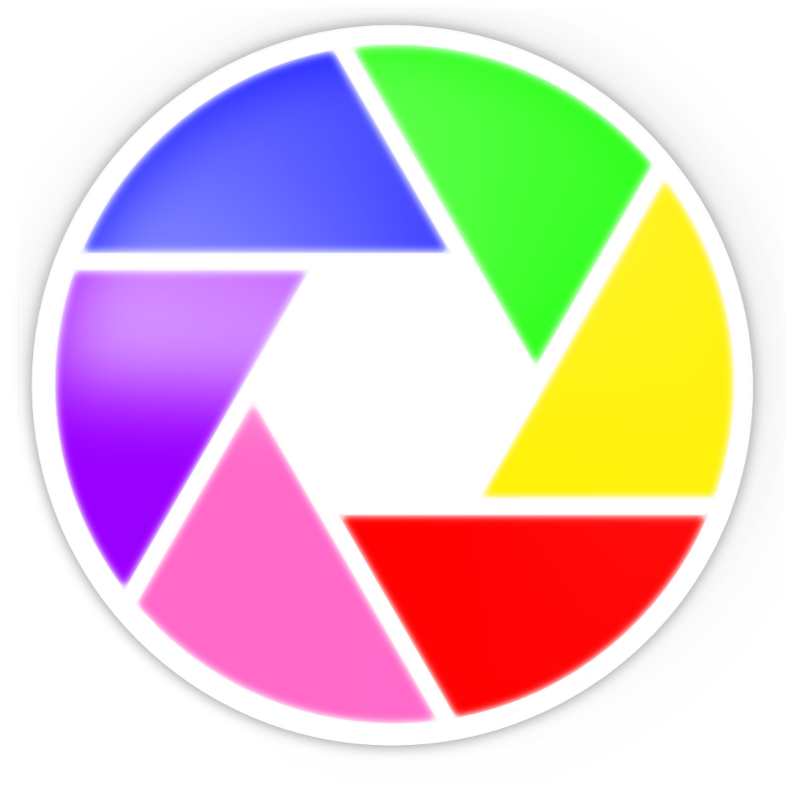

#  Collasa Collage Maker 

A lightweight web app remake of Google Picasa’s Collage Maker. All original features should be included plus some extra, with some modernized design updates.

Background features:
- Paper Texture Toggle
- Solid Color (custom color available)
- Filled background image
- Tiled background image

Photo Features:
- Border options: No border, white border, polaroid style border
- Customizable drop shadow strength.
- Auto arrange to grid with adjustable spacing or make a pile.
- Photos can be moved, resized, rotated, and layered with send to front and back options.

Can export to PNG or JPG.

|Aspect Ratio                  |Export size     |
|------------------------|--------------------|
|4:3 Landscape           |4000×3000           |
|16:10 Widescreen Monitor|4000×2500           |
|Square                  |4000×4000           |
|16:9 Widescreen         |3840×2160 (true UHD)|
|3:4 Portrait            |3000×4000           |
|2:3 Tall Portrait       |2664×3996           |

Created using HTML and Claude.
